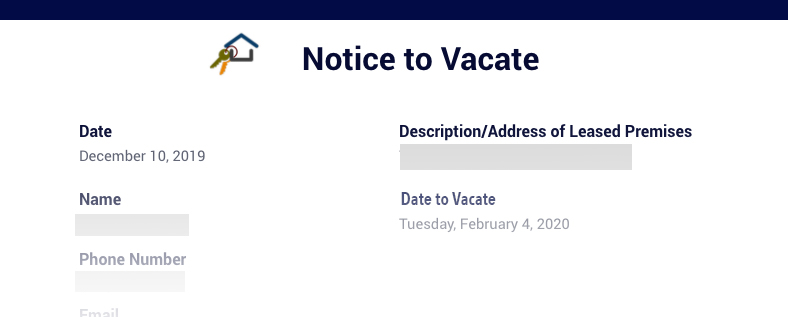
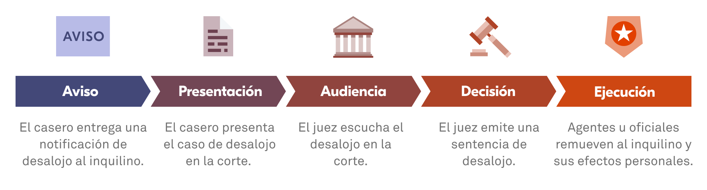
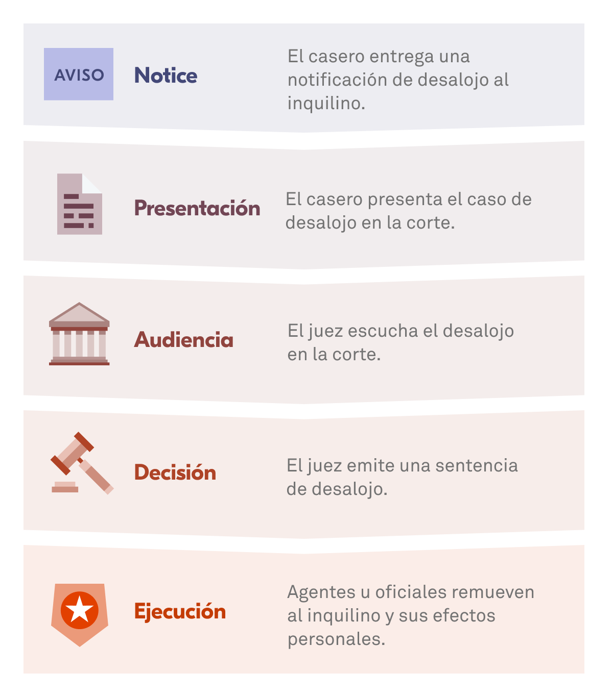

La pandemia del COVID-19 ha generado tremendas dificultades para cientos de miles de personas a la hora de pagar la renta y mantener su vivienda. En el Eviction Lab, creemos que todos se merecen un hogar, especialmente durante una emergencia como esta. 

La siguiente es una guía con algunas de las más relevantes preguntas que los inquilinos podrían tener en el momento que las protecciones contra el desalojo empiezan a expirar. Llamamos a todos a aprender sobre sus derechos en la corte, postular a asistencia de renta y buscar apoyo legal. 

*Este sitio web tiene como intención entregar información general sobre políticas de desalojos y no constituye ayuda legal. Por favor consulte con un abogado en su estado para consejos sobre materias legales específicas.*

 

### ¿Qué esperar de un proceso de desalojo?

{{< faq 

"are-renters-protected" 

"¿Existen protecciones para los inquilinos que enfrentan un desalojo en la actualidad?"

"La moratoria de los CDC venció el 31 de julio. El 3 de agosto, los CDC anunciaron una nueva orden, que creó una moratoria similar para áreas que “están experimentando altos niveles de transmisión comunitaria”, de acuerdo a la agencia. Esta orden vence el 3 de octubre."

"Como sucedió con la anterior moratoria, para ser protegido, un inquilino debe declarar lo siguiente:"

"<ul><li>Que ha intentado obtener asistencia de renta.</li><li>Que su ingreso es menor a ciertos límites establecidos por la orden.</li><li>Que no puede pagar la renta completamente debido a pérdida de ingresos, horas de trabajo, despidos o gastos médicos extraordinarios.</li><li>Que ha hecho su mejor esfuerzo para hacer pagos parciales de renta.</li>Que arriesga quedar sin techo si es desalojado.<li>Que reside en un condado de Estados Unidos que actualmente experimenta índices altos o sustanciales de transmisión de COVID-19, de acuerdo a los CDC.</li></ul>"

"A través de todo el país, los inquilinos tienen derecho otorgado por la constitución al debido proceso, lo que significa que tienen derecho a ser escuchados y disputar un desalojo en la corte. En algunos lugares específicos, los inquilinos tienen que pagar un depósito –pagar la renta que deben en una cuenta administrada por el sistema de cortes– para tener una audiencia, sin embargo esto no es muy común."

"Al menos cuatro estados --California, Nueva Jersey, Nueva York, Hawái, y también el Distrito de Columbia-- tienen sus propias moratorias."

"Recomendamos contactar a organizaciones locales de vivienda y <a href='https://www.lsc.gov/what-legal-aid/find-legal-aid' target='_blank' rel='noreferrer noopener'>de ayuda lega</a> en su ciudad o su estado para aprender sobre sus derechos, conseguir apoyo legal y encontrar la información más actualizada. Puede encontrar más organizaciones locales a través de <a href='https://iolta.org/program-directory/#us-programs' target='_blank' rel='noreferrer noopener'>las organizaciones estatales de abogados y de la organización nacional NAIP</a>. Hay información sobre asistencia legal en los sitios del <a href='https://www.abafreelegalanswers.org/' target='_blank' rel='noreferrer noopener'>Colegio Estadounidense de Abogados (en inglés</a> y en <a href='https://espanol.lawhelp.org/' target='_blank' rel='noreferrer noopener'>LawHelp.org</a> Encuentre o publique recursos sobre su comunidad en nuestro sitio hermano <a href='https://justshelter.org/community-resources/' target='_blank' rel='noreferrer noopener'>Just Shelter</a>."

>}}

{{< faq 

"cant-afford-rent" 

"No he podido pagar la renta, ¿Qué puedo hacer ahora?"

"Hay miles de millones de dólares disponibles en asistencia para la renta a través de todo el país. Puede llamar al 2-1-1 para preguntar cómo postular a estos fondos en su área. Dependiendo de dónde se encuentre, estos programas pueden estar administrados por la ciudad, el condado, el estado o una organización sin fines de lucro. Puede encontrar <a href='https://nlihc.org/rental-assistance' target='_blank' rel='noreferrer noopener'>cientos de estos programas de asistencia de renta en esta lista (en inglés)</a>."

"La Oficina de Protección Financiera para los Consumidores ha creado una herramienta en la que inquilinos y caseros pueden buscar programas de ayuda de acuerdo a su ubicación: www.consumerfinance.gov/renthelp."

"Le recomendamos postular a la asistencia de renta lo más rápido posible, ya que el proceso para conseguir el dinero puede demorar semanas o meses. Si su casero o administrador presenta tu desalojo en la corte mientras usted espera que su postulación sea procesada, asegúrese de dar aviso en la corte que está en este proceso."

"Dependiendo de los distintos programas existentes en su área, su casero quizás deberá cooperar con el programa para que usted reciba la ayuda para la renta, y el programa en algunas ocasiones le dará la asistencia de renta directamente al casero o a la administración de su edificio. En otros lugares, si el casero no colabora con el programa o envía los formularios requeridos, el programa podría pagarle directamente a usted. Si su casero no está colaborando con el proceso, pregunte si es posible que usted reciba la ayuda financiera directamente."

>}}

{{< faq 

"lost-home" 

"Ya perdí mi hogar. ¿Puedo recibir asistencia de renta para una nueva vivienda? ¿Puedo optar a otros beneficios?"

"Si ya ha perdido su vivienda, llame al 2-1-1 o consulte nuestro sitio <a href='https://justshelter.org' target='_blank' rel='noreferrer noopener'>Just Shelter</a> para encontrar información sobre albergues, proveedores de vivienda y apoyo disponible en su comunidad. En algunos estados, los programas de asistencia de renta sí están permitiendo usar los fondos para reubicación y usted podría postular para otros beneficios. Es importante agregar que los veteranos y miembros de fuerzas armadas en servicio tienen ciertos derechos en lo que concierne a desalojos y acceso a apoyo legal adicional."

>}} 

 

### Encontrar un abogado

{{< faq 

"find-a-lawyer" 

"¿Cómo puedo encontrar un abogado, que me pueda ayudar a entender mis derechos y defenderme contra un desalojo?"

"Los inquilinos pueden presentarse en la corte con un abogado que los represente. Trabajar con un abogado experto en vivienda puede ayudar a los inquilinos a tener un caso más sólido. Hay servicios de apoyo legal gratuitos en todo el país. Para postular a estos, contacte a su <a href='https://www.lsc.gov/what-legal-aid/find-legal-aid' target='_blank' rel='noreferrer noopener'>agencia local de servicios legales</a>. Los siguientes recursos le podrían ayudar a encontrar respuestas legales o representación legal para su caso en la corte:"

"<ul><li><a href='https://www.lsc.gov/about-lsc/what-legal-aid/get-legal-help' target='_blank' rel='noreferrer noopener'>La Corporación de Servicios Legales - Lista de oficinas de apoyo legal</a></li><li><a href='https://espanol.lawhelp.org/' target='_blank' rel='noreferrer noopener'>LawHelp.org</a> - Formularios interactivos y una lista de oficinas de apoyo legal</li><li><a href='https://iolta.org/program-directory/#us-programs' target='_blank' rel='noreferrer noopener'>Asociación Nacional de Programas IOLTA - Encuentre oficinas de ayuda legal</a></li><li><a href='' target='_blank' rel='noreferrer noopener'>Respuestas legales gratuitas (en inglés) - Sistema basado en correos electrónicos para obtener respuestas legales de abogados voluntarios</a></li></ul>"

"Un abogado puede ayudar a los inquilinos a explicar su defensa o pedirle a un juez más tiempo (lo que se conoce como “requesting a continuance” en inglés), o lograr que el caso se selle o que el caso sea desestimado. Los inquilinos deben mencionar siempre, sin importar si tienen un abogado, si es que han firmado <a href='https://www.cdc.gov/coronavirus/2019-ncov/downloads/evictiondeclare_d508.pdf' target='_blank' rel='noreferrer noopener'>la declaración de los CDC</a> o si han postulado a asistencia de renta."

"Si alguien es desalojado, podría igual recibir ayuda de emergencia para renta y servicios de consejería de vivienda para identificar las mejores formas de pagar la renta en un nuevo hogar." 

>}} 

 

### Qué sucede cuando va a la corte

{{< faq 

"notice-to-vacate" 

"Recibí un papel o un documento de mi casero diciendo que debo dejar la vivienda. ¿Qué significa esto en realidad?"

""

"Una notificación de desalojo o “notice to vacate” en inglés es el primer paso de un proceso que puede durar semanas o incluso meses. La mayoría de los estados requieren que los caseros le entreguen un aviso de su intención de comenzar el proceso de desalojo en la corte."

""

""

"Cada estado tiene diferentes requerimientos sobre lo cómo se hace una notificación de desalojo: puede ser un papel pegado en su puerta; puede ser una carta enviada por correo certificado; puede que su casero tenga que contactarlo en persona; o puede que lo contacte por teléfono para notificarlo que intentará comenzar un caso de desalojo en su contra."

"<ul class='d-none'><li>Problemas con la notificación o las citaciones. Si la notificación o las citaciones fueron presentadas incorrectamente --por ejemplo, el casero esperó el periodo de tiempo requerido por la ley-- el caso podría ser desestimado.</li><li>Condiciones inhabitables de la vivienda. En algunos estados y ciudades, los inquilinos tienen derecho a suspender el pago de su renta si es que la vivienda tiene problemas importantes, como no tener calefacción.</li><li>Represalias. En algunos estados está prohibido por ley que los caseros desalojen a alguien luego de que el inquilino reporte problemas con su vivienda a la ciudad o municipalidad.</li><li>Ciertas protecciones de una moratoria.</li><li>El casero ya ha recibido asistencia de renta, por lo que el inquilino ya no debe la renta.</li></ul>"

"Dependiendo de las leyes estatales o locales, usted podría tener derecho a resolver los problemas planteados en la notificación y evitar un desalojo. Esto se le llama “right to cure en inglés."

"Luego de entregar esta notificación y esperar un periodo de tiempo, el que varía en cada estado, el casero normalmente debe presentar el caso en la corte y la corte le entregará una citación al inquilino para una audiencia. Durante la audiencia, los inquilinos pueden explicar su defensa. Sus argumentos para la defensa dependen de donde usted viva, por lo que es importante hablar con un proveedor de apoyo legal para encontrar qué argumentos sirven en su ciudad."

"Si el juez decide el caso a favor del casero, el juez puede emitir una orden de desalojo o “writ of possession” en inglés.  Los inquilinos pueden apelar a la decisión, dejar la propiedad o esperar hasta que un alguacil u otro funcionario ejecute el desalojo, retirando las posesiones del inquilino de la vivienda."

>}} 

{{< faq 

"eviction-stopped-by-moratorium" 

"Mi desalojo fue detenido debido a la moratoria. ¿Qué sucederá conmigo si es que una corte anula la moratoria o cuando la moratoria de los CDC se acabe? ¿Cuáles son mis opciones?"

"Dependiendo de las cortes locales, el casero y la situación de su caso, el proceso de desalojo podría reiniciarse. Si estaba en el comienzo de este proceso, quizás tendrá que ir a una audiencia en la corte. En otros casos, puede que usted ya esté hacia el final del proceso y la ejecución del desalojo podría ser mucho más rápida."

"Manténgase en contacto con su casero, su corte local y cualquier organización que le pueda entregar ayuda legal, para entender su caso en particular y en qué punto de su desalojo se encuentra. También usted debería <a href='https://nlihc.org/rental-assistance' target='_blank' rel='noreferrer noopener'>postular a asistencia de renta</a> en el programa de su ciudad, condado o estado. Consulte información local para poder identificar programas o busque programas en esta lista (en inglés): <a href='https://nlihc.org/rental-assistance' target='_blank' rel='noreferrer noopener'>https://nlihc.org/rental-assistance</a>."

"En algunos estados y localidades, puede que usted aún esté protegido por moratorias específicas. Llame al 2-1-1 para entender qué recursos están disponibles en su área. También puede encontrar información de ayuda legal y organizaciones de apoyo en todo el país en este sitio <a href='https://www.lsc.gov/what-legal-aid/find-legal-aid' target='_blank' rel='noreferrer noopener'>https://www.lsc.gov/what-legal-aid/find-legal-aid</a>."

>}} 

{{< faq 

"have-money-but-landlord-wants-to-evict" 

"En la actualidad tengo dinero, pero mi casero todavía quiere desalojarme. ¿Puede hacerlo?"

"Esto depende de la ciudad o el estado donde usted viva. En muchos estados, la ley autoriza a  los caseros a comenzar procedimientos de desalojo una vez que el inquilino se atrase con el pago y no están obligados a aceptar pagos atrasados o parciales. Los caseros también podrían aceptar un pago atrasado y aún así intentar desalojar a alguien ya que pagó tarde. Al mismo tiempo, en algunos lugares los caseros tienen la obligación de aceptar pagos atrasados luego de presentar el caso en la corte, y en esos lugares deben retirar el caso en su contra."

"En algunos estados y ciudades, pueden existir regulaciones que permitan a los inquilinos ponerse al día con la renta o crear un periodo de gracia antes de que se comience un proceso judicial de desalojo. Contacte a servicios legales y al 2-1-1 para preguntar sobre las regulaciones donde usted vive. Pregunte si es que los caseros están obligados a aceptar pagos tardíos y si es que la corte puede desestimar un caso cuando usted paga la renta antes de su audiencia."

>}} 

{{< faq 

"other-moratoriums" 

"Más allá de la moratoria de los CDC, ¿existen otras moratorias actualmente funcionando?"

"Los CDC ordenaron una nueva moratoria de desalojos el 3 de agosto, para condados con niveles de transmisión de COVID-19 altos o sustanciales."

"Además, todavía podría existir una moratoria local contra los desalojos en su ciudad."

"Algunas ciudades, condados y estados han creado sus propias moratorias y las han extendido más allá del 31 de julio."

"Algunos edificios que han sido financiados con programas de préstamos federales, como los que entregan Fannie Mae y Freddie Mac también tienen su propia moratoria, la que expirará el 31 de septiembre si no es renovada." >}} 

{{< faq 

"eviction-credit-score" 

"¿Cómo afecta un desalojo a mi puntaje crediticio? ¿Puede un desalojo afectar mis reportes de créditos u otros créditos de consumo?"

"Un desalojo normalmente no afecta directamente el puntaje crediticio, pero las deudas pendientes sí pueden aparecer en un reporte de crédito, incluyendo pagos tardíos de renta y cargos por atrasos que usted adeude. "

"Los desalojos pueden aparecer en otros reportes de consumo y hacer que sea más difícil postular a una nueva vivienda en el futuro, si es que el casero chequea su historial como inquilino. "

>}}

{{< faq 

"eviction-new-home" 

"¿Cómo afecta mi desalojo la posibilidad de encontrar una nueva vivienda? ¿Por qué es importante intentar sellar el registro luego de un caso de desalojo? ¿Es posible hacer eso en cualquier lugar?"

"Cuando se presenta un caso de desalojo a la corte, se transforma en un registro público. Esto podría permitir a un futuro casero chequear el historial de desalojos de un postulante y negar una postulación, incluso si usted ganó el caso o no tuvo que dejar su hogar. En algunos estados, los inquilinos pueden sellar el registro de su caso de desalojo. Esto podría hacer más fácil encontrar vivienda en el futuro. En otros lugares, algunos casos de desalojo se sellan automáticamente."

"Revise su situación en el <a href='https://evictionlab.org/covid-policy-scorecard/'>sitio de políticas de vivienda durante COVID-19 que Eviction Lab ha compilado</a>, para así saber si los casos de desalojo se sellan en su estado. Pregunte en las cortes de su área o en agencias de servicios legales para ver si puede sellar su caso. Las agencias de servicios legales pueden apoyarlo en estos intentos, especialmente si usted trabajó con ayuda legal durante su desalojo o si ganó su caso."

>}}

{{< faq 

"undocumented-rights-in-court" 

"Soy indocumentado. ¿Tengo los mismos derechos en la corte? ¿Puedo postular a asistencia de renta o ayuda legal gratuita?"

"No importa cuál sea su estatus migratorio en Estados Unidos, usted sigue teniendo derecho a una audiencia en la corte, aunque en algunos lugares específicos quizás tendrá que presentar un depósito. <a href='https://www.cbp.gov/sites/default/files/assets/documents/2021-Apr/Enforcement-Actions-in-Courthouses-04-26-21.pdf' target='_blank' rel='noreferrer noopener'>De acuerdo a las nuevas reglas de la administración Biden</a>, los agentes de Inmigración (ICE) no pueden detener a nadie dentro de una corte."

"En algunas ciudades los indocumentados también pueden postular a ayuda legal gratuita y existen organizaciones no gubernamentales y abogados pro bono que entregan apoyo legal y asesorías a inmigrantes. Muchos programas de asistencia de renta aceptan postulantes indocumentados."

"Si un casero o administrador lo amenaza con llamar a agentes de inmigración para echarlo, usted puede encontrar ayuda en organizaciones de inmigración y agencias de apoyo legal. Puede encontrar una lista de organizaciones que ayudan y apoyan a los inmigrantes en temas legales aquí: <a href='https://www.immigrationadvocates.org/nonprofit/legaldirectory/' target='_blank' rel='noreferrer noopener'>https://www.immigrationadvocates.org/nonprofit/legaldirectory/</a>."

>}}

 

### CÓMO MARCAR UNA DIFERENCIA

