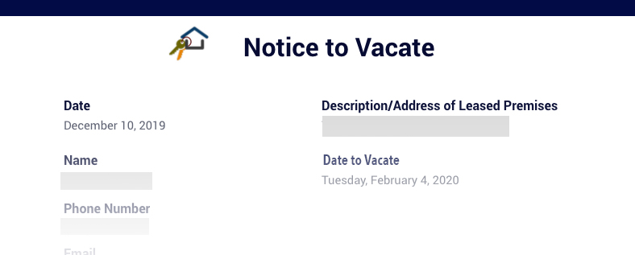

The COVID-19 pandemic has made it difficult for hundreds of thousands of people to pay rent and stay housed. At the Eviction Lab, we believe that everyone deserves a place to call home, especially during an emergency like this. 

The following is a guide with some of the most relevant questions that tenants could have as the eviction protections lapse. We are encouraging everyone to learn about your rights in court, apply to rental assistance and search for legal counsel.

 

### What to Expect from the Eviction Process

{{< faq 

"are-renters-protected" 

"Are renters protected from eviction right now?"

"The CDC moratorium was extended until July 31st and protects eligible renters from eviction in nearly every part of the country (one exception is the <a href='https://www.cbsnews.com/news/eviction-memphis-crisis-court-cdc-ban/' target='_blank' rel='noreferrer noopener'>Western District of Tennessee</a>, which includes Memphis). Renters should provide a copy of the <a href='https://www.cdc.gov/coronavirus/2019-ncov/downloads/evictiondeclare_d508.pdf' target='_blank' rel='noreferrer noopener'>declaration form</a> to their landlord and in any eviction hearing. <a href='https://evictionlab.org/moratorium-extended-evictions-continue/'>More information about the federal moratorium, including who is covered by the moratorium, is available here</a>."

"Across the country, renters also have a constitutional right to due process, which means they have the right to be heard and can dispute an eviction in court. Although it is not common, in some specific places, tenants might have to post a bond--pay the rent that they owe to an account held by the court system--to get a hearing."

"There are at least four states—New Jersey, New York, Hawaii, Vermont and, also the District of Columbia among them—that have their own moratoria in place."

"Contact local housing advocates and <a href='https://www.lsc.gov/what-legal-aid/find-legal-aid' target='_blank' rel='noreferrer noopener'>legal aid organizations</a> in your city or state to learn your rights, seek legal counsel and find the most up to date information. More legal aid providers can be found through <a href='https://iolta.org/program-directory/#us-programs' target='_blank' rel='noreferrer noopener'>state bar associations (associations of all attorneys in the state) and NAIP</a>. More legal assistance can be found from the American Bar Association and LawHelp.org. Find or post resources in your community to <a href='https://justshelter.org/community-resources/' target='_blank' rel='noreferrer noopener'>our sister website Just Shelter</a>."

>}}

{{< faq 

"cant-afford-rent" 

"I have been unable to afford the rent, what can I do?"

"Billions of dollars in rental assistance funds are now available nationwide. Call 2-1-1 to learn more about how to apply for the rental assistance available in your area. Depending on where you live, these programs might be managed by a city, a county, a state or a non-profit. You can find hundreds of <a href='https://nlihc.org/rental-assistance' target='_blank' rel='noreferrer noopener'>rental assistance programs available in this list</a>."

"Apply for rental assistance as quickly as you can, since the process of getting the money may take weeks or months. If your landlord files to evict you while you are waiting to hear back about your application, be sure to let the court know that you have an application pending."

"Depending on the program in your area, your landlord might need to cooperate with the program, and the program will pay the rental assistance to the landlord or property management company directly. In other places, if your landlord does not cooperate with the program or send in required forms, the program will pay the tenant directly. If your landlord does not cooperate with the program, ask if it's possible for the assistance to be issued to you instead."

>}}

{{< faq 

"lost-home" 

"I’ve already lost my home. Can I access rental assistance for a new place? Am I eligible for any other resources?"

"If you've already lost your home, call 2-1-1 or check <a href='https://justshelter.org' target='_blank' rel='noreferrer noopener'>Just Shelter</a> to find out about shelters, housing providers, and support available in your community. In some states, rental assistance programs are allowing funds to be used for relocation, and you could be eligible for other benefits. Also, veterans and active duty service members have certain rights in eviction and access to additional legal counsel. "

>}} 

 

### Find a Lawyer

{{< faq 

"how-to-find-a-lawyer" 

"How can I find a lawyer to help me understand my rights and defend against an eviction?"

"Renters may bring an attorney to represent them. Working with a housing attorney could strengthen a renter’s case. There are free legal services across the country. To apply, contact a <a href='https://www.lsc.gov/what-legal-aid/find-legal-aid' target='_blank' rel='noreferrer noopener'>local legal aid office</a>. The following resources can help you find legal answers or legal representation in court:"

"<ul><li><a href='https://www.lsc.gov/about-lsc/what-legal-aid/get-legal-help' target='_blank' rel='noreferrer noopener'>Legal Services Corporation - List of legal aid offices</a></li><li><a href='https://www.lawhelp.org/' target='_blank' rel='noreferrer noopener'>LawHelp.org</a> - Interactive forms and list of legal aid offices</li><li><a href='https://iolta.org/program-directory/#us-programs' target='_blank' rel='noreferrer noopener'>National Association of IOLTA Programs - Find legal aid offices</a></li><li><a href='https://www.abafreelegalanswers.org/' target='_blank' rel='noreferrer noopener'>Free Legal Answers - Email-based legal answers from volunteer attorneys</a></li></ul>"

"Attorneys can help tenants raise defenses or ask the judge for more time (called requesting a continuance), or have the case sealed or dismissed. Renters should mention, regardless of whether they have an attorney, if they have a <a href='https://www.cdc.gov/coronavirus/2019-ncov/downloads/evictiondeclare_d508.pdf' target='_blank' rel='noreferrer noopener'>CDC declaration form</a> or have applied for rental assistance."

"If someone is evicted, they may be eligible for emergency rental assistance and housing counseling services to help identify and pay the rent in a new home." 

>}} 

 

### What to Expect from Housing Court 

{{< faq 

"notice-to-vacate" 

"I got a paper from my landlord saying that I have to leave. What does this actually mean?"

""

"A “notice to vacate” is the first step in a process that can last weeks or even months. Most states require landlords to give you a notice of their intent to file an eviction. Depending on your state and local law, you may have a right to address any issues cited in the notice and avoid an eviction case. This is called the “right to cure.” "

""

""

"After delivering the notice of eviction and waiting a certain period of time, which varies by state, the landlord typically files an eviction case in court and the court serves the renter with a summons for a hearing. During the hearing, renters can raise defenses to the eviction. Depending on the state or municipality, defenses might include:"

"<ul><li>Problems with the notice or summons. If the notice or summons were served incorrectly--for example if the landlord did not wait for the whole notice period before filing to evict the renter--the case might be dismissed.</li><li>Uninhabitable conditions. In some states and cities, tenants have a right to withhold rent if their home has major problems, like not having heat.</li><li>Retaliation. In some states, landlords are legally prohibited from evicting a tenant after the tenant reports problems with the unit to the city or town.</li><li>Coverage under a moratorium.</li><li>The landlord has received rental assistance or a late rental payment, so the tenant no longer owes late rent.</li></ul>"

"If the judge decides in favor of the landlord, the judge may issue a writ of possession. Renters can appeal the decision, leave the property, or wait until the sheriff or other party executes the writ by removing the renters’ possessions out of the unit. "

>}} 

{{< faq 

"eviction-stopped-by-moratorium" 

"My eviction was stopped because of the moratorium. What will happen to me if the moratorium is overturned by a court or  when the CDC moratorium ends? What are my options?"

"Depending on the local courts, your landlord, and the status of your dispute, the eviction process might _restart_. If you were in an early stage of the eviction you might have to go to a court hearing. In some other cases, you might be at the end of the process and the actual execution of the eviction might happen much sooner. "

"Stay in touch with your landlord, with your local court, and with any organization that can provide legal assistance, to understand your particular case and how far you are in the eviction timeline. You should also apply for <a href='https://nlihc.org/rental-assistance' target='_blank' rel='noreferrer noopener'>rental assistance</a> in your city, county or state program. Consult with your local information line to identify programs or <a href='https://nlihc.org/rental-assistance' target='_blank' rel='noreferrer noopener'>search for programs here</a>."

"In some states and localities, you may still be protected by specific moratoriums. Call 2-1-1 to understand what resources are available in your area. You can find information for <a href='https://www.lsc.gov/what-legal-aid/find-legal-aid' target='_blank' rel='noreferrer noopener'>legal aid organizations across the country at this site</a>."

>}} 

{{< faq 

"have-money-but-landlord-wants-to-evict" 

"I have the money now, but my landlord still wants to evict me. Can they do that?"

"That depends on where you live. In many states landlords are allowed by law to start eviction proceedings once the tenant is late on rent, and they're not required to accept late or partial payments. Landlords might also be able to accept the late payment, but evict you anyway for paying late. On the other hand, in some places, landlords are required to accept a late payment that you make soon after the eviction filing, and withdraw the court case against you."

"In some states and cities, there might be regulations that allow tenants to catch up in rent or create a grace period before starting an eviction court case. Contact legal services and 2-1-1 to ask about the regulations where you live. Ask whether landlords are required to accept late payments, and whether the court must dismiss your eviction case if you pay what you owe before your eviction hearing."

>}} 

{{< faq 

"other-moratoriums" 

"Besides the CDC eviction moratorium, are there other kinds of moratoriums still in place?"

"There might be local eviction moratoria still in place in your city."

"Some cities, counties and states have created their own moratorium and they have extended them beyond July 31st."

"Building complexes that were financed by some federal loan programs like the ones provided by Fannie Mae and Freddie Mac also have a moratorium of their own, <a href='https://www.fhfa.gov/Media/PublicAffairs/Pages/FHFA-Extends-COVID-19-Foreclosure-and-REO-Eviction-Moratoriums.aspx' target='_blank' rel='noreferrer noopener'>which will expire on July 31</a> if it is not renewed."

>}} 



{{< faq 

"eviction-new-home" 

"How does eviction affect my ability to find a new home? Why is it important to try to seal my record after an eviction case? Is that possible everywhere?"

"When an eviction case is filed, it can become a public record. This could allow a future landlord to check the eviction history of an applicant and deny an application--even if you win your case or do not leave your home. In some states, renters are allowed to seal the record of the eviction case. This could make it easier for you to find new housing in the future. In other places, eviction cases are sealed automatically in many situations."

"Check the <a href='https://evictionlab.org/covid-policy-scorecard/'>Eviction Lab COVID-19 Housing Policy Scorecard</a> to see if eviction cases from the pandemic are sealed in your state. Check with the court system in your area, or with legal services, to see if or how you can request to have your eviction case sealed. Legal services may be able to help you get your eviction case sealed, especially if you worked with legal services during your eviction hearing or if you won your case."

>}}

{{< faq 

"undocumented-rights-in-court" 

"I am undocumented. Do I have the same rights in court? Can I apply for rental assistance or free legal help?"

"No matter your legal status in the United States, you are still entitled to a hearing in court, although in some specific places you might need to post a bond. According to <a href='https://www.cbp.gov/sites/default/files/assets/documents/2021-Apr/Enforcement-Actions-in-Courthouses-04-26-21.pdf' target='_blank' rel='noreferrer noopener'>new rules issued during the Biden administration</a>, officers from Immigrations and Customs Enforcement (ICE) can’t detain people in a courthouse."

"In some cities you may also be allowed to apply for free legal assistance, and there are non-governmental organizations and pro bono attorneys that provide legal support and consultation for immigrants. Many rental assistance programs also accept applications from undocumented renters."

"If a landlord or an apartment manager threatens to call immigration officers to force you out, you could find help in immigrant organizations as well as some legal aid organizations. You can find <a href='https://www.immigrationadvocates.org/nonprofit/legaldirectory/' target='_blank' rel='noreferrer noopener'>a list of organizations that help and support immigrant in legal affairs here.</a>"

>}}

 

### How to make a difference

{{< faq 

"address-housing-insecurity" 

"How do I address housing security in my community?"

"Renters across the United States have found strength in speaking to one another and organizing for better housing conditions, from experiences during the <a href='https://www.retroreport.org/video/new-york-tenants-are-organizing-against-evictions-as-they-did-in-the-great-depression/' target='_blank' rel='noreferrer noopener'>Great Depression</a>, <a href='https://www.nytimes.com/video/learning/100000007368071/tenants-facing-eviction-over-covid-19-look-to-a-1970s-solution-retro-report.html' target='_blank' rel='noreferrer noopener'>the 1970s</a>, to <a href='https://www.retroreport.org/video/how-decades-of-housing-discrimination-hurts-fresno-in-the-pandemic/' target='_blank' rel='noreferrer noopener'>today</a>. Consider contacting your neighbors, local tenants union, and housing advocates to learn more."

>}}