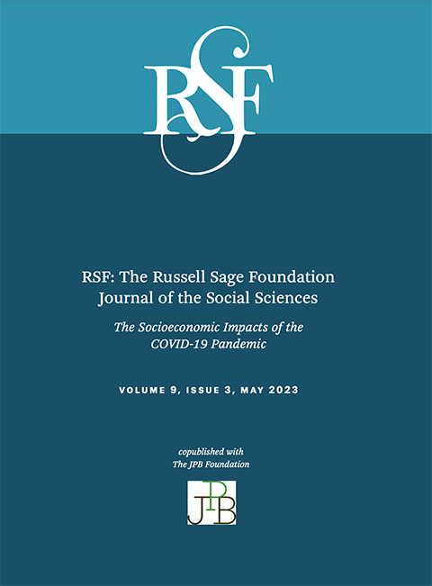

Millions of people were laid off over the course of just a few weeks in spring 2020 as COVID-19 lockdowns were put in place nationwide. Job losses were concentrated in industries that employ a large number of renters, especially the retail, service, and tourism sectors. With few jobs available and limited savings, these tenants were at immediate risk of eviction if they could not pay next month’s rent. Evictions in turn raised the prospect of more households ending up homeless or doubled-up with friends or relatives, conditions that foster the spread of COVID-19. 

Responding to the unfolding emergency, policymakers at the federal, state, and local levels enacted a range of new policies. These included eviction moratoria to prevent immediate displacement, stimulus payments and expanded unemployment insurance that allowed many tenants to stay current on rent, and emergency rental assistance (ERA) to help them catch up if they fell behind. 

These policies drove eviction filing rates to historic lows. Take the [Hill District in Pittsburgh, PA](https://www.google.com/maps/place/Pittsburgh,+PA+15219/@40.4506351,-79.9822375,13z/data=!3m1!4b1!4m6!3m5!1s0x8834f15f65521405:0xa3568b4291b83a30!8m2!3d40.440368!4d-79.9836108!16s%2Fm%2F020tq_f) as an example. The Hill District is adjacent to Downtown Pittsburgh, nestled between  the Allegheny and Monongahela Rivers. The neighborhood has a median household income of around $25,000 and, during a typical period extending from mid-March to the end of December of the following year, would be the site of nearly 1,000 eviction case filings. Between the start of the COVID-19 pandemic (March 15, 2020) and December 31, 2021, only 186 cases were filed, a reduction of 81.2%. 



In a research article published in *[RSF: The Russell Sage Foundation Journal of the Social Sciences](https://www.rsfjournal.org/content/9/3/186.abstract)*, we trace these patterns in 31 cities across the United States. We assess the cumulative effects of pandemic-era policies, analyzing changes in eviction filing patterns over the first two years of the COVID-19 pandemic. We pay particular attention to what these policies did to address socio-economic, racial/ethnic, and gender disparities in eviction risk that predated the pandemic. 

    

        
    

    

READ THE STUDY:

        
<a class="green gt-eesti journal-heading" href="https://www.rsfjournal.org/content/9/3/186.abstract" target="_blank" rel="noreferrer noopener">Protecting the Most Vulnerable: Policy Response and Eviction Filing Patterns During the COVID-19 Pandemic</a>

        
by Peter Hepburn, Jacob Haas, Nick Graetz, Renee Louis, Devin Q. Rutan, Anne Kat Alexander, Jasmine Rangel, Olivia Jin, Emily Benfer, and Matthew Desmond

    

In the article, we draw on the records of eviction case filings from cities across the country that we have collected through the [Eviction Tracking System](https://evictionlab.org/eviction-tracking/). Those include five of the ten largest cities in the U.S.—Dallas, Houston, New York City, Philadelphia, and Phoenix—but also a number of smaller places like Gainesville, FL and Wilmington, DE.1 All of these cities were covered by some form of local eviction moratorium at the start of the pandemic, often closing courts due to public health concerns. However, many state and local governments began rolling back protections in mid-2020: half of these cities had no meaningful emergency eviction protections in place after August 31, 2020.

Between the start of the pandemic and the end of 2021, we recorded the filing of almost 600,000 eviction cases in these 31 cities. Under normal circumstances, we would have expected over 1.4 million cases to be filed over the same timeframe. That means that we observed 800,000 fewer eviction cases filed than normal in these 31 cities, a reduction of 57.6%. 



In Figure 1 we show what these reductions looked like, month by month. We plot eviction filings relative to the pre-pandemic average from January 2020 through December 2021. Filings were reduced most dramatically in the early months of the pandemic, dropping as low as 8.6 percent of historical average in April 2020. By fall 2020—with the CDC eviction moratorium in place nationwide—this rate had increased to approximately 50 percent of historical average. Filings remained around this level [throughout the duration of the CDC moratorium](https://evictionlab.org/eleven-months-cdc/), and increased slightly after it was struck down by the U.S. Supreme Court in late August, 2021. The study period of this analysis only extends through the end of 2021; if we were to extend this figure through 2022, [we would see filings returning to pre-pandemic levels](https://evictionlab.org/ets-report-2022/).

{{% bar-chart
  id="fig1"
  data="./fig1_blog_daily_by_month.csv"
  x="monthDate"
  y="pct_of_historical"
  yMin="0"
  yTooltipFormat=".1%"
  yFormat=".0%"
  title="Figure 1. Eviction filings relative to historical average, by month"
  margin="8 8 104 40"
  axis="time"
  timeUnit="month"
%}}

Eviction filings were reduced much more in some cities than in others. Differences in how county courts interpreted and implemented federal eviction moratoria—as well as establishment of additional state- or local-level protections—led to a lot of variation in eviction filing rates. In Figure 2 we plot cumulative eviction filings relative to historical average in each city. Case filings ranged from 78.2 percent of historical average in Las Vegas to 15.2 percent in Austin.

{}

Simply based on where they lived, a tenant struggling to pay rent was at much greater risk of receiving an eviction filing in Columbus than in New York. Cities that had the strongest and longest-lasting eviction moratoria fell on the bottom of Figure 2. For example, except under exceptional circumstances, landlords in Minneapolis-St. Paul could not start the eviction process between March 16, 2020 and June 30, 2021. Over the full study period, eviction filings fell by 81.7% in the Twin Cities. By contrast, cities with weaker and shorter-lived protections cluster on the top of Figure 2.

We also explore what effect these protections had in different sorts of neighborhoods. One way of doing that was to look at neighborhoods that normally see lots of eviction cases and those that see relatively few. Pre-COVID, one in every six renters faced an eviction filing each year in a typical high-eviction neighborhood. That fell to one in twelve renters risking eviction during the pandemic. Reductions in eviction filings were much larger in these neighborhoods that normally see the most eviction cases. Eviction filings fell by almost two-thirds in high-eviction neighborhoods and only one-third in low-eviction neighborhoods.  Of the 800,000 eviction cases that were avoided during this period, over 475,000 of them—almost 60%—were missing from the one-fifth of neighborhoods that normally see the most cases filed. 

Another way of analyzing this variation was to look at eviction filings by neighborhood racial/ethnic composition. In Figure 3 we plot historical and pandemic-era eviction filing rates in majority-Black, majority-Latino, and majority-White neighborhoods, as well as well as those neighborhoods with no racial/ethnic majority.2

{{% grouped-bar-chart 
  id="fig3-mfr" 
  titlePrefix="Figure 3. Median eviction filings rates prior to and during the COVID-19 pandemic by neighborhood racial/ethnic majority" 
  titleSuffix="" 
  data="./fig3.csv" 
  x="id" 
  y="mfr_w_20" 
  yTicks="5" 
  yMin="0"
  yFormat=".1%" 
  xTicks="Black;Latino;White;Other/None" 
  columns="id,mfr_20_w,mfr_hi_w,mfr_20_b,mfr_hi_b,mfr_20_l,mfr_hi_l,mfr_20_o,mfr_hi_o" 
  xBars="mfr_hi_b,mfr_20_b;mfr_hi_l,mfr_20_l;mfr_hi_w,mfr_20_w;mfr_hi_o,mfr_20_o" 
  xFormat="" 
  highlight="mfr_hi;mfr_20" 
  active="0" 
  type="barGroup" 
  searchId="id" 
  legendItems="Historical Average;2020-2021" 
  search="false" 
  searchPrompt="" 
%}}

The largest reductions in eviction filings were in majority-Black neighborhoods. Under normal, pre-pandemic circumstances, the typical majority-Black neighborhood in our sample had an eviction filing rate of 12.2%, 8.5 percentage points higher than that in a majority-White neighborhood (3.7%). That gap narrowed to 3.5 percentage points during the pandemic. Still, the typical majority-Black neighborhood had a filing rate during the pandemic that was higher than the typical White neighborhood pre-pandemic (5.3% vs. 3.7%). Even with filing rates cut by more than half, the risk of eviction in majority-Black neighborhoods was greater than equivalent risk in majority-White spaces prior to the pandemic.

In the article’s final section, we evaluate the effects of strong local eviction moratoria: protections that went beyond federal measures and stopped the earliest stages of the eviction process. This sort of evaluation is complicated because of all the various policies that were being implemented simultaneously. We’re able to take advantage of the timing of these local measures to estimate their specific impact. Doing so, we show that strong eviction moratoria significantly reduced eviction filings when they were put in place, and that eviction filings jumped considerably when these policies were phased out. Effect sizes are large and [confirm previous findings on the importance of such policies in driving down eviction filing rates](https://evictionlab.org/assessing-state-eviction-prevention-covid-19/). 



Our findings highlight both the potential and the limitations of public policies aimed at reducing the prevalence of eviction. We show that an unprecedented combination of restrictions to the eviction process, income supports, and direct ERA payments to landlords and tenants resulted in a significant reduction in eviction caseloads for a prolonged period. In the 31 cities that we analyzed, we found that 57.6% fewer eviction cases than normal were filed between March 15, 2020 and December 31, 2021. This reduction in filings was concentrated in neighborhoods that normally see the most eviction cases. Filing rates were cut by more than half in majority-Black neighborhoods and in neighborhoods with lowest median income. Black women saw the largest absolute reduction in eviction filing rates.       

Despite these massive reductions, inequalities in eviction risk remained, both between and within cities. During the pandemic, a tenant in Minneapolis struggling to pay rent would have been much better protected from the threat of eviction than an equivalent tenant in Las Vegas. While the absolute reduction in case filings was largest in majority-Black and lower-income neighborhoods, these changes did not eliminate inequalities that existed prior to the pandemic. Lower-income neighborhoods still saw much higher rates of eviction filing than more-affluent neighborhoods. The reduction in filing rates in majority-Black neighborhoods that we documented in Figure 3 still left them higher rates than in majority-White neighborhoods prior to the pandemic.

Still, the fact that inequalities endured should not distract from the fact that hundreds of thousands fewer households than normal in these cities faced the threat of eviction during the worst months of the COVID-19 pandemic. Future research should aim to explore the full significance of those reductions, both for households who avoided displacement and for communities seeing far less churn. Against a backdrop of tremendous economic and public health uncertainty, what did that increased residential stability entail for individuals’ health and well-being? For children’s educational attainment? For the neighborhood as a whole? Answering these questions can help us to better understand what benefits cities may be losing as [filings trend upwards, returning to or even surpassing pre-pandemic levels](https://evictionlab.org/ets-report-2022/). Future research should also further examine the effects of rental assistance programs and other more lasting reforms to the eviction system. 

{{< blogfootnotes 
"We would like to thank the [many organizations and individuals](https://evictionlab.org/eviction-tracking/acknowledgements/) who contributed data or assistance for the Eviction Tracking System. The city sites described in this piece often follow county boundaries; see the full article for further information."

"Neighborhood racial/ethnic majority and median incomes were determined on the basis of ACS five-year estimates from 2015-2019 for the full population (i.e., not just those living in rental housing)." >}}