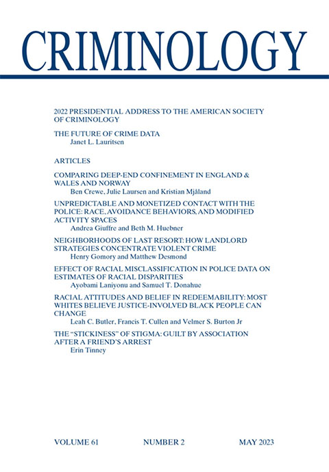

For more than a decade, Curtis Hoff ran a Milwaukee real estate empire that rented run-down properties to tenants with few other options. Hoff got his start around 2000, and by 2021—the year he sold off his properties—he owned over 700 units, mostly in Milwaukee’s majority-Black North side. He purchased many of these properties through . 

As described in , Hoff and his staff routinely ignored tenants’ maintenance requests, refusing to deal with cockroach and rodent infestations and malfunctioning heat and plumbing. But when tenants fell behind on rent, Hoff was quick to file eviction cases. This strategy made sense because eviction filings intimidate tenants, saddle them with fees, limit future housing options by damaging rental histories, and grant the landlord considerable legal power—even if no eviction is ever executed. Indeed, eviction was so central to Hoff’s business strategy that he gave the holding companies listed as the owners of these properties names beginning with the letter A, such as “Aardvark Properties,” to ensure they would be at the top of the docket in eviction court. 

In , we investigate the management practices of landlords like Hoff and the implications for tenants and communities. Focusing on the case of Milwaukee, we find that, in addition to fostering housing insecurity and creating hazardous living conditions for their tenants, landlords who rely on these strategies also make their properties and neighborhoods less safe.

    

        
    

    

READ THE STUDY:

        
<a class="green gt-eesti journal-heading" href="https://onlinelibrary.wiley.com/doi/abs/10.1111/1745-9125.12332" target="_blank" rel="noreferrer noopener">Neighborhoods of last resort: How landlord strategies concentrate violent crime</a>

        
by Henry Gomory and Matthew Desmond

    

Most crime in Milwaukee is concentrated in a set of properties that are owned by a very small number of landlords. The properties owned by only 1.9% of landlords were the site of more than half of all assaults at rental properties between 2016 and 2018. Owners of these properties were also responsible for large numbers of eviction filings and housing code violations, suggesting that their extractive business practices were putting tenants in danger.

To show that these extractive strategies matter—that this pattern wasn’t just driven by landlords who happened to specialize in dangerous neighborhoods—we go a step further. We developed a measure of landlords’ extractive management practices that reflects their rates of eviction filings and housing code violations. We tested whether more crimes occur in properties owned by landlords who score higher on this measure of extractive practices. Doing so, we control for a large set of property and neighborhood factors. 

All else equal, properties owned by landlords with a pattern of extractive management have dramatically higher rates of assault (Figure 1). Properties managed by extractive landlords also show higher levels of burglary, robbery, and other types of crime.

{}
  

    

Note: Figure 1 shows the expected assault rates at four-unit properties with the same physical characteristics and neighborhood locations, but different types of landlords. Compared to properties owned by the average landlord, those managed by landlords with a history of extractive management have much higher assault rates, even after controlling for property and neighborhood characteristics.
    

     
  

What is it about these extractive strategies that leads to more crime? First, run-down properties—places with faulty window locks, rickety doors, and malfunctioning lights—make crimes like burglary that much easier. Second, frequent evictions undermine residential stability and neighborhood cohesion. It’s hard to develop trust or a sense of community—a key aspect in crime prevention—if people are constantly getting evicted. Third, neglectful landlords rarely visit their properties, and may be more likely to turn a blind eye to illegal activity. Fourth, these landlords more often rent to tenants who may be more likely to commit crimes and are turned away by other landlords. 

But this is not the story of a few “bad apple” landlords. Extractive management styles like Hoff’s are an inevitable consequence of these markets as currently configured. 

Tenants looking to rent in low-income markets often lack other housing options, making them a captive market. Landlords like Hoff are able to fill their properties, despite their neglect, because their tenants rarely have other places that will take them. At a time when eviction, financial precarity, and incarceration have become distressingly common, tenants with imperfect records represent a sizable customer base. These factors contribute to the enormous power disparities between extractive landlords and their tenants. Hoff and other landlords like him own hundreds of housing units yielding , while their tenants typically live paycheck to paycheck. These landlords can afford to rack up housing code fines without hurting their bottom line, while tenants often avoid reporting violations out of fear of retaliatory eviction. 



Most of the tenants preyed upon by extractive landlords in Milwaukee are Black. Segregation and discrimination reduce housing options and make Black renters easier targets for extractive landlords. In majority-Black neighborhoods, worse quality products are routinely sold for inflated prices, a dynamic that has been called the “Black tax.” This pattern has been documented in many types of purchases, from groceries to electronics, and clearly exists in the rental housing market as well. This exploitation is often justified by appeals to racist narratives. In the case of housing, this leads to claims that low-income Black tenants are responsible for the dilapidation of their own properties. For example, 

Extractive landlord strategies are most common in stigmatized neighborhoods, places avoided by those who have other options. In particular, we find that the level of crime within a neighborhood is one of the strongest predictors of extractive landlord management. In higher-crime neighborhoods, tenants are much more likely to report having chosen their housing as a last resort and to have unaddressed maintenance problems (Figure 2). This makes sense, since public safety is a key factor renters consider when choosing where to live. People who end up in high-crime areas are the ones with few alternatives.

Figure 2. Relationship between neighborhood crime and extractive management

  

{}
  

    

Plot A shows the probability that a tenant reports choosing their current residence as a last resort, in average and high-crime neighborhoods, after controlling for property and neighborhood characteristics. In areas with more crime, tenants are much more likely to say they chose their current residence as a last resort.
    

  

  

  

{}
  

    

Plot B shows the expected number of housing problems reported by tenants in average and high-crime neighborhoods, after controlling for property and neighborhood characteristics. In areas with more crime, tenants report many more housing problems, suggesting high-crime areas incentivize under maintenance by landlords.
    

  

  

This highlights a vicious cycle: as neighborhoods become dangerous and undesirable, those with the ability to move out do so. Landlords with properties in these places turn to extractive strategies to exploit those who have no option but to stay. These strategies in turn increase the level of crime at their properties, further stigmatizing the neighborhood and incentivizing extractive strategies. 

What could be done to disrupt this cycle? One idea is to ban the screening of tenants based on eviction, credit, and criminal histories. This could increase renters’ housing options, reduce the power differential between them and their landlords, and force landlords to provide better services. City agencies should pair such efforts with increased anti-discrimination enforcement, however, to ensure that banning screening does not lead to other forms of bias.



Another potential solution is to increase housing code enforcement. Policy changes at the state level under former Governor Scott Walker undermined the City of Milwaukee’s ability to enforce the housing code. Bolstering city agencies’ powers could make it harder for landlords to neglect their properties and help ensure that every tenant’s home is safe and habitable. Increased housing code enforcement, however, should be carried out proactively by city agencies rather than relying on tenants to report violations, which can lead to retaliation from landlords.  

Finally, some cities have revoked rental licenses from landlords with a history of housing code violations or tax avoidance, removing the most egregious landlords from the market. The criteria for revoking licenses should be chosen carefully to avoid encouraging other landlords to intimidate tenants away from reporting violations.

These sorts of policies make it more difficult for landlords to carry out exploitative management strategies. Another approach is to expand housing that is not managed for extractive purposes, for example by investing in subsidized housing run by nonprofits and community organizations. Nonprofit-run housing could offer quality homes paired with other social programs to aid tenants whose limited housing options make them particularly vulnerable in the private market. Especially for renters who have an eviction record or who are re-entering society after time in prison, these sorts of options can be a critical lifeline. This would benefit not only tenants, but their communities as a whole, reducing property disinvestment and fostering residential stability. 
