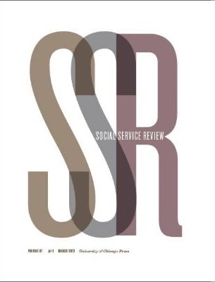

Early in the COVID-19 pandemic, Lizzie, a Black single mother living in Connecticut, was struggling to keep up with rent. She was only working one day a week after her employer cut her hours and her rental debt was growing. “Every month [I would see] that increase and the number get bigger, it got scary.” But Lizzie lived in a state with a strong eviction moratorium. That protection bought her enough time to apply for rental assistance, which she got just before her landlord intended to kick her out. “It never actually made it to court, because that is when the program came through”, she explained. “The timing was excellent.”

Lizzie was one of the millions of tenants who risked losing their homes to eviction during the pandemic. Federal, state and local leaders attempted to prevent widespread eviction—and its —during the pandemic through [moratoria and other protections](https://evictionlab.org/assessing-state-eviction-prevention-covid-19/). [Previous research has shown how effective these policies were in reducing formal case filings](https://evictionlab.org/covid-era-policies-cut-eviction-filings-by-more-than-half/), but how did renters understand, interpret, and respond to these protections in their daily lives? How did they benefit and what challenges did they experience accessing these benefits?

To answer these questions, we interviewed 60 tenants in Connecticut, Ohio and Florida, all of whom were at risk of or who had experienced eviction, between March and September 2021. Their stories illustrate how moratoria supported tenants, and also how they fell short. In an article in the journal Social Service Review, we report back on our findings, examining what these policies meant to renters, how they shaped their well-being and housing security, how racism shaped policy effects, and how these experiences varied across different policy landscapes.

    

        
    

    

READ THE ARTICLE:

        
<a class="green gt-eesti journal-heading" href="https://www.journals.uchicago.edu/doi/10.1086/725320" target="_blank" rel="noreferrer noopener">“A Little Bit of a Security Blanket”: Renter Experiences with COVID-19–Era Eviction Moratoriums</a>

        
Danya E. Keene, Whitney Denary, Annie Harper, Anna Kapolka, Emily A. Benfer, and Peter Hepburn

    

We conducted interviews in three states with very different eviction moratoria. In Connecticut, the state moratorium offered strong protections, freezing most stages of the eviction process for well over a year. In Florida, tenant protections against eviction were weaker and short-lived, expiring entirely by early fall of 2020. Ohio, the third state where we carried out interviews, never implemented a statewide eviction moratorium, though several cities enacted their own protections. These three states reflect the patchwork policy response to the pandemic. In addition to federal protections, 43 states and the District of Columbia established their own eviction moratoria, [but these policies varied in terms of what protections they provided and how long they were in place](https://evictionlab.org/assessing-state-eviction-prevention-covid-19/).

Many of the renters we interviewed described how moratoria created space to strategize, secure resources, and address rental debt. When Oliver, a renter in Connecticut, lost his job and fell behind on rent, the state moratorium gave him time to find a new job, catch up, and avoid eviction. Others shared that, as in Lizzie’s case, moratoria provided them time to access emergency rental assistance. For example, Jane was able to pay down three months of back rent and avoid eviction after receiving a grant from the Salvation Army. She recalled hearing about the moratoria and thinking “that's all I needed to hear at the time, to give myself a little bit of a security blanket. I would say that it gave me some breathing room.”
 
While moratoria provided some relief from an immediate eviction, virtually everyone we spoke with knew that rent would eventually come due. Over and over again we heard renters describe the urgent need to keep up with payments. For example, despite reassurance from her landlord that she could not be evicted during the moratoria, Lynn, a Black woman living in subsidized housing in Connecticut, described the importance of catching up on rent. She explained that people should “try to get it paid up because if you're in the hole or a deficit and they lift that ban... you're stuck and you could get evicted. So, my biggest thing is pay it off while you can.”  

Other tenants noted the danger of being lulled into a false sense of security. “It can even make things worse if you, like, just continue not to pay the rent. Because when the pandemic is over… [t]hey're gonna evict you then, so… I'm trying to catch up on mine so I wouldn't have that problem,” Sly, another renter in Connecticut, told us.  


 
Although millions of Americans benefited from these policies, many of the renters we interviewed were still skeptical that moratoria would protect them. A few noted correctly that the CDC moratorium only prevented evictions for non-payment of rent, opening a possible loophole for landlords to file for other reasons. Others described how eligibility rules left them unprotected. For example, Florida’s state moratorium restricted protections to those whose job loss was considered COVID-related, leaving some tenants vulnerable when they could not prove this was the case. 

Some renters said that they were convinced that landlords' access to money and legal representation would allow them to get around eviction protections. "Don’t underestimate the mind of a landlord, if they’ve got money,” Misha, a renter in Connecticut, warned. 

Finally, racism also shaped participants’ trust in moratoria: several of the Black renters we spoke with raised concerns about discrimination and mistrust. Martin, a Black Florida renter, described experiencing racism and disrespect when he was seeking rental assistance. “I just gave up trying to at least get these things and decided that enough was enough, and let me move on and just forget that this thing almost existed.”
 
The stories shared by tenants also showed how the requirements to apply for protections undermined their effectiveness. A few tenants we spoke with were evicted without ever learning about the moratoria and existing benefits. Others were unable to file a declaration for protection, as was required by the CDC moratorium. Participants also described the hassles of accessing emergency rental assistance prior to the substantial rollout of federal ERA funds. As Peter, a Black renter in Connecticut, noted, "now you've gotta go through loops and circles and all kinds of stuff just to get this money, and then they make you wait, and then the rent is still building up while you're waiting.” 

A few of the renters we spoke with had previous experience trying to prove their eligibility for other programs, like food stamps, housing vouchers, and welfare. Knowing how hard and time-consuming those processes can be undermined their belief in eviction protections or willingness to engage.  “I thought it just seemed too good to be true,” Ashley, a white renter in Ohio, said. “I felt like… it would probably be like flaming hoops to jump through.”
 
All of these factors contributed to uncertainty about eviction moratoria, and this led some participants to leave their homes preemptively. Sometimes that meant moving in with friends or family—precisely the sort of doubled-up housing arrangements that eviction moratoria attempted to prevent. Other renters moved out because their large rental debts made eviction seem inevitable. For example, Peter explained, “I can't go the amount that I owe [my landlord] now and to get to a few more months…. I can't sit nowhere and be owing nobody $10,000 and don’t have a decent job to pay that back.”

 

 
Based on these interviews, we make three recommendations for the design of future housing stabilization policies.

First, additional time is critical for renters. Delaying the eviction process—buying tenants time—helped to prevent immediate displacement that could have had long-term negative consequences for well-being and housing security. Policies that slow the eviction process can allow tenants to find resources to pay landlords and avoid losing their homes, an outcome that could benefit both them and their landlords. 

Second, policy success requires directed outreach. Many of the renters we spoke with did not know of or fully understand eviction moratoria. Community outreach and trusted messengers are critical in implementing successful policies, especially when they are targeted to historically marginalized populations. 

Third, work to minimize barriers and burdens. When moratoria included more procedural hassles, they did not work as well. That in turn breeds mistrust and suspicion, making future programs that much more difficult.

Our interviews show how eviction moratoria provided critical breathing room for tenants struggling to pay rent during the COVID-19 pandemic. Still, their experiences also show how the impact of these policies on housing security and tenant well-being may have been undermined by lack of trust, gaps in eligibility, administrative burdens, landlord-tenant power dynamics, and the large unmet need for affordable rental housing that remains at the root of the current eviction crisis. Our findings offer important lessons for future eviction-prevention, social services, and civil-legal policy making.


