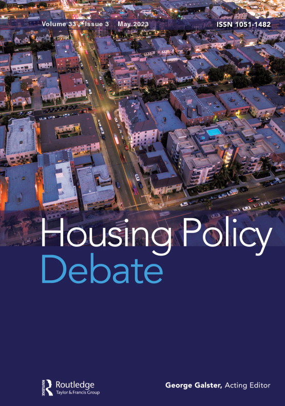

By most measures, Alabama is a hard place to be poor. The state has one of the lowest minimum wages in the country ($7.25/hr) and almost half of renters are burdened by high costs, devoting more than 30% of their income to housing. This is a situation that we would expect to lead to high eviction rates, but that’s not the case: Alabama’s eviction filing rate in 2018 was only 3.8%. That’s half the national average (7.8%) and far below rates found in neighboring states like Mississippi (14.7%) and Georgia (18.8%). How is it that renters in Alabama largely avoid the threat of eviction?

One explanation is the price that landlords have to pay for evicting a family. When a landlord goes to court in Mississippi, they usually pay a filing fee of $65 to start the process. In Georgia, it’s $87, on average. But in Alabama the average fee is $276. That higher price changes landlords’ economic calculus and encourages them to work with their tenants rather than turning immediately to the courts. In a research article published in the journal <em>Housing Policy Debate</em>, we show that higher filing fees lead to lower eviction rates, and that effects are largest for renters in majority-Black neighborhoods.

    

        
    

    

READ THE ARTICLE:

        
<a class="green gt-eesti journal-heading" href="https://www.tandfonline.com/doi/abs/10.1080/10511482.2023.2212662" target="_blank" rel="noreferrer noopener">The Racially Disparate Influence of Filing Fees on Eviction Rates</a>

        
Henry Gomory, Douglas S. Massey, James R. Hendrickson, and Matthew Desmond

    

The difference in filing fees between Alabama, Mississippi, and Georgia is not unique to these three states. As part of this project, we collected filing fee information from all counties across the U.S. On average, the filing fee for an eviction case is $109, but the range is broad, from a low of $15 in much of Marylandup to $350 in Lee County, Alabama. In Figure 1 we map this out, showing just how widely these filing fees vary. We are making the data underlying this map publicly available for download <a href="./filing_fees.csv">here</a>. 

{}

We wanted to understand how these filing fees affected eviction patterns. But a lot more than just filing fees change when moving from one state to the next. Differences in demographics, wealth, and political context could also affect eviction rates. We used multiple statistical methods to control for these differences. The result is that we can estimate the causal effect of filing fees on three key measures of eviction prevalence: the eviction filing rate (how often landlords file cases); the [serial eviction filing rate](https://evictionlab.org/serial-eviction-filings/) (how often they file repeated cases against the same household at the same address); and the eviction judgment rate (how often judgments are handed down against tenants). 

We find that the cost of filing an eviction case has a clear and powerful effect on how often landlords turn to the courts. Specifically, increasing the filing fee by $100 reduces the eviction filing rate by 2.25 percentage points. For context, the eviction filing rate in the median neighborhood in our sample is 3.3%. That $100 increase to the filing fee would more than halve its number of eviction cases. It would also drive down the eviction judgment rate by 0.64 percentage points, directly helping to keep tenants in their homes.  



When landlords pay less to file an eviction case, they often use the courts to help them collect rent. Instead of talking with tenants whose payments are late or working out plans to help families get back on track, some landlords file for eviction as soon as rent is past-due, thinking that the threat of removal is the most effective way to get tenants to pay. For renters with irregular pay schedules, this can mean that they get filed against repeatedly even though they’re consistently able to catch up with payments. Landlords pass the costs of these filings on to the tenants, and the filings themselves—even those that don’t lead to removal—still form a record that makes it harder for tenants to find housing in future. We find that increasing the filing fee significantly reduces this form of serial eviction filing. 

While finding that higher fees discourage eviction filings may not be surprising, the size of the effect is. Going from a $50 filing fee to a $200 filing fee would reduce eviction filing rates by 3.4 percentage points. That’s the same as jumping from a poor neighborhood—one with median income of $30,000—to a well-off area (median income of $100,000). In other words, raising filing fees could reduce eviction rates to the same degree as increasing tenants’ incomes by tens of thousands of dollars.

Low eviction filing fees have a particularly high price for Black tenants. We found that for all outcomes—filings, serial filings, and judgments—the effect of increasing the filing fee in driving down eviction rates was much larger in majority-Black than in majority-white neighborhoods (see Figure 2). That effect holds even after controlling for differences in socioeconomic status, rents, and a wide array of other factors that differ between white and Black neighborhoods. 

{}

The disparate impact of filing fees in Black neighborhoods reflects the racialization of landlords’ eviction practices. [In segregated Black areas, landlords are much more likely to adopt an extractive, high-eviction management style](https://evictionlab.org/extractive-landlords-and-crime/). Such landlords rarely make repairs and resort to eviction frequently. Due to a combination of economic factors and racial discrimination, [eviction rates in Black neighborhoods are typically much higher than in comparable white and Hispanic areas](https://evictionlab.org/demographics-of-eviction/).  

Is raising the filing fee by $100 really enough to affect landlords’ decisions about eviction? That sum may appear insignificant compared to the rent that a landlord can lose when a tenant doesn’t pay. But costs add up. Especially for landlords who turn to the courts regularly, increasing the filing fee raises operating costs and changes the logic around eviction. 



Current eviction filing fees aren’t set for any particularly good reasons and don’t reflect the actual cost of the court administrative process. In many counties, these fees are simply the same as for any other civil court cases. In Minnesota, for example, filing an eviction case costs the same amount as filing for divorce or formally adopting a child. In other areas, court fees are raised or lowered for arbitrary reasons, such as funding a new court library or roadside memorial. [A report from Illinois](https://www.illinoiscourts.gov/Resources/4b970035-98ba-4110-86fc-60e02b6a126b/2016_Statutory_Court_Fee_Task_Force_Report.pdf) describes court fees as “a Byzantine system… a complex web of filing fees, fines, surcharges, and other costs… wildly inconsistent from county to county.”  This has led to the patchwork of high and low filing fees that we saw in Figure 1. This randomness was useful in our analysis because it allowed us to compare high- and low-fee areas that were otherwise very similar. 

This variation in filing fees also signals an opportunity for policymakers looking for ways to improve housing stability. If people are paying the same amount to get divorced as to evict a tenant, it exposes the fundamental arbitrariness of these fees. Filing fees are bureaucratic artifacts that have little reason to remain at their current levels. Increasing these fees could dramatically reduce evictions and help tenants remain stably housed. 
