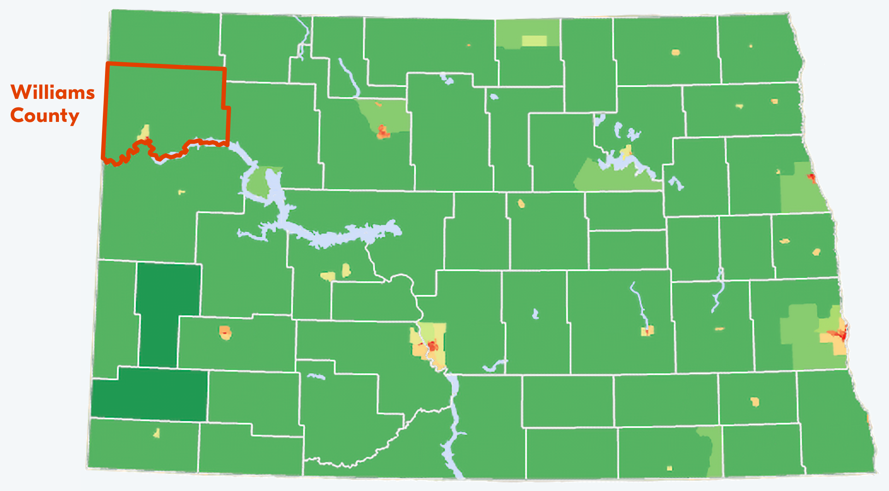

Williams County, North Dakota changed radically in just ten years. Its population doubled between 2010 and 2020 as new drilling technologies—including —enabled an oil boom that made this isolated corner of North Dakota one of the centers of the global oil trade. As investment flooded the region, wages increased from $55,000 a year to around $80,000. Many locals prospered as their property values went up and their businesses found new customers. But others suffered, especially those who found that the cost of living grew faster than their income.

Figure 1: North Dakota Population Per Square Mile (Based on 2010 Census Data)

{}

 

A new study published in  shows how commodity booms affect communities like Williston, the county seat of Williams County. In Williams County, eviction filings used to be extremely rare: In 2010, the filing rate was merely 0.002%. But by 2019, the filing rate was over 7%, rivaling major cities like New York and Philadelphia.



In order to understand how commodity booms are tied to housing instability, we analyzed monthly eviction counts in Williams County alongside data on oil production, the housing market, and the local economy between 2000 and 2022. 

Before the boom, Williams County’s eviction rates were extremely low thanks to the region's affordable rents. Few local renters would have had occasion to notice how . North Dakota law allows a landlord to file an eviction against a tenant as soon as three days after a missed payment. It  also allows a court summons to be served only three days before an eviction hearing, which makes it difficult for a tenant to obtain legal advice or to rearrange their schedule to be present at court. 

The weakness of the state’s eviction laws became obvious as rents surged in Williams County. By 2010, there were reports of . Motels had no vacancies. A field hand reported paying . Williams County was not only the fracking capital of North Dakota but it had also become its eviction capital: in 2019, nearly 17% of all evictions filed in the state were filed here, despite representing only 5% of the state’s total population.

Evictions climbed in lockstep with oil production, as shown in Figure 2. Between 2000 and 2019, oil production increased in the county from 300,000 barrels a month to 7.5 million barrels a month. In 2000, landlords would file only one or two evictions a month in the county. But by 2019, there were 42 eviction filings per month in Williams County. 

Figure 2. Monthly Eviction Filings and Oil Production in Williams County, ND

<iframe class="visual" src="https://production--eviction-lab-site.netlify.app/blog/fracking-and-eviction-viz/"></iframe>

Evictions and oil production peaked in 2019. The COVID-19 pandemic disrupted demand for oil, leading to . At the same time, emergency protections at the state and federal level, , temporarily kept renters in their homes.

Our study also looked at who was evicted, using renters’ address histories. According to our analysis, only 16% of the defendants had a majority of their previous addresses outside of North Dakota. This suggests that it was long-term North Dakotans—not migrants who were attracted by the booming economy—who were most exposed to eviction. While fracking is often presented as a boon for local economies, our analysis shows that many locals were excluded from the economic benefits.

Williams County is an extreme example, but oil and gas booms have been linked to increases in rents, homelessness, and evictions across the country. Our [National Eviction Map](https://evictionlab.org/map) shows that eviction filings rates have increased in other places like [Midland](https://evictionlab.org/map/?m=modeled&c=p&b=efr&s=all&r=counties&y=2018&z=9.65&lat=31.87&lon=-102.03&lang=en&l=48329_-102.03_31.87) and [Odessa](https://evictionlab.org/map/?m=modeled&c=p&b=efr&s=all&r=counties&y=2018&z=9.65&lat=31.87&lon=-102.54&lang=en&l=48329_-102.03_31.87%7E48135_-102.54_31.87) in Texas, at the heart of the Permian Basin. 

Williams County is a cautionary tale for communities courting industries that might cause a sudden economic boom. Local officials need a housing plan in place before the boom arrives. Exclusionary zoning practices can prevent the construction of multifamily apartments and manufactured home communities, which are the largest private sources of affordable housing. Local officials should also consider adopting the kinds of tenant protections that are more commonly associated with big cities, but which become necessary as local rental markets become more competitive. 

Subsidizing renters and affordable housing is important, but federal resources are insufficient for the task. Housing became so expensive in Williston, ND that the local housing authority ran up against its budgetary capacity when only 50% of its authorized Housing Choice Vouchers were in use. Through policies like , communities can raise revenue from the profits generated by the new industries, allowing them to further support existing residents in need of affordable housing.

Evictions were at an , indicating that renters there could still benefit from local officials strengthening tenant protections. Other oil and gas-producing communities—indeed, any community that might undergo rapid transformation due to the arrival of new industries—would also benefit from planning ahead and protecting renters before they lose their homes.
