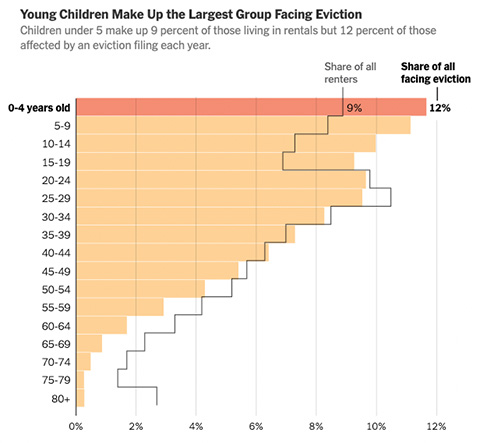

Through a groundbreaking collaboration with the U.S. Census Bureau, we are able to provide a comprehensive picture of the full population of renters living in households that were threatened with eviction between 2007 and 2016 (we describe the full methodology below). We are able to demonstrate, for the first time, the sheer number of people facing the threat of eviction, the scale of racial/ethnic disparities in eviction risk, and the heavy burden of eviction faced by children. Across the life-course, the risk of experiencing an eviction—a deeply traumatizing event—is highest during childhood. Evicted children face increased risk of food insecurity, exposure to environmental hazards, academic challenges, and a range of long-term physical and mental health problems. We now know that nearly three million children face these risks every single year.

These data offer an unprecedented opportunity to understand eviction risk in America. They also make clear that several groups officially protected from housing discrimination by the [Fair Housing Act](https://www.hud.gov/program_offices/fair_housing_equal_opp/fair_housing_act_overview) (FHA) are at disproportionately high risk of eviction. We describe our findings in an article published in the _Proceedings of the National Academy of Sciences_ and highlight five key results here.

    

        
    

    

READ THE STUDY:

        
<a class="green gt-eesti journal-heading" href='https://www.pnas.org/doi/10.1073/pnas.2305860120' target="_blank" rel="noreferrer noopener">A comprehensive demographic profile of the US evicted population</a>

        
Nick Graetz, Carl Gershenson, Peter Hepburn, and Matthew Desmond

    

    

        
    

    

READ COVERAGE IN THE NEW YORK TIMES:

        
<a class="green gt-eesti journal-heading" href='https://www.nytimes.com/2023/10/02/upshot/evictions-children-american-renters.html' target="_blank" rel="noreferrer noopener">The Americans Most Threatened by Eviction: Young Children</a>

    

### 7.6 Million Renters Face the Threat of Eviction Annually

[Previous work documenting the prevalence of eviction has counted the number of](https://evictionlab.org/new-eviction-data-2022/) [_households_](https://evictionlab.org/new-eviction-data-2022/) [that face the threat of eviction](https://evictionlab.org/new-eviction-data-2022/). But we knew almost nothing about who exactly lives in those homes. Documents from courts only give us the names of the people listed on the lease and their address. Previously, we've been able to estimate [racial and gender disparities in eviction risk](https://evictionlab.org/demographics-of-eviction/) using this information. But those estimates are imperfect, and only account for the people listed in the filing.

Here, for the first time, we're able to count all the people living in those households. We find that, on average, 7.6 million _individuals_ were threatened with eviction every year between 2007 and 2016. Just over half of these individuals—3.9 million people—lived in a household that received an eviction judgment.



If we relied solely on court records to count people threatened with eviction, we would miss more than half of these individuals. Of the 7.6 million people living in a household threatened with eviction, only 42.1% of them were actually listed on court filings.

### Children Face the Highest Eviction Rates

Every year, 2.9 million children under age 18 are threatened with eviction and 1.5 million are evicted. These children represent four in every ten people who are threatened with eviction each year.

Those under age 20 are at greatest risk of eviction. In Figure 1, we display [eviction filing rates](https://evictionlab.org/help-faq/#eviction-rate) (and, if you toggle the figure, eviction rates) by gender and five-year age category. Eviction rates in the first four age categories—covering ages 0 to 19—are higher than in any subsequent category. Over 10% of all children below age five living in rental housing were threatened with eviction annually, and 5.7% were evicted.

  

{}

  

  

{}

  

<ul class="nav nav-pills nav--population-pyramid mb-3" id="pills-population-pyramid" role="tablist" data-toggle="pills">
  <li class="nav-item" role="presentation">
    <a class="nav-link active" id="pills-counts-tab" data-toggle="pill" href="#pop-py-efr" role="tab" aria-controls="pills-counts" aria-selected="true">Eviction Filing Rate</a>
  </li>
  <li class="nav-item" role="presentation">
    <a class="nav-link" id="pills-relative-tab" data-toggle="pill" href="#pop-py-er" role="tab" aria-controls="pills-relative" aria-selected="false">Eviction Rate</a>
  </li>
</ul>
 
The risk of eviction declines at older ages, but slowly. Around one in every nine renters threatened with eviction every year—almost 830,000 people—are over the age of 50. Nearly 170,000 seniors age 65+ face the threat of eviction every year. In short, eviction isn't just a young person's issue: it affects renters across the life course.

### Those Living with Children are at the Highest Risk of Eviction

Households that include children are filed against for eviction at high rates. Indeed, the eviction filing rate for adults living with a child was 10.4%, over double the risk for adults living without children (5.0%).

Another way to think about this is in terms of households that were threatened with eviction and those that weren't. Among households that didn't get filed against for eviction, roughly one-third included children. By contrast, over half (52.2%) of households that were filed against had a child present.

### Black Renters face a Disproportionate Burden

Black renters face a disproportionate share of evictions. Less than one in every five renters in America is Black (18.8%), but over half of all eviction filings are against Black renters (51.1%).

This also means that Black renters face far higher risk of eviction than any other group. Between 2007 and 2016, roughly one in five Black adult renters were living in a household filed against for eviction and roughly one in ten were evicted each year. By contrast, on average, one in 24 white adult renters was threatened with eviction annually and one in 40 was evicted.

Eviction filing and eviction rates for Hispanic adult renters were comparable to those for white renters. Asian renters consistently had the lowest eviction filing and eviction rates. It's worth noting, though, that our results relate only to formal evictions filed with the courts. Members of these groups—particularly foreign-born renters who don't have legal documentation—may be disproportionately subjected to informal or illegal evictions that are not measured by court records.

Racial disparities in eviction risk are also compounded by the higher risk of eviction faced by those living with children. Figure 2 displays eviction rates for adult renters by race/ethnicity, broken down by whether the individual lives in a household with a child. Annual eviction filing rates among Black adults living with kids surpass 25%, well over double the risk faced by members of any other group.

Figure 2. Eviction rates among adult renters, by race/ethnicity and presence of children

  

{{% grouped-bar-chart 
  id="gbc2" 
  saneLoading="EFR,race,children"
  titlePrefix="" 
  data="./fig2saneloading.csv" 
  yTicks="5" 
  yMin="0"
  yMax="0.3"
  yFormat=".1%" 
  type="barGroup" 
  search="false" 
  themed="true"
  autoGenLegend="true"
%}}

  

  

{{% grouped-bar-chart
  id="gbc2a" 
  saneLoading="ER,race,children"
  titlePrefix="" 
  data="./fig2saneloading.csv" 
  yTicks="5" 
  yMin="0"
  yMax="0.3"
  yFormat=".1%" 
  type="barGroup" 
  search="false" 
  themed="true"
  autoGenLegend="true"
%}}

  

<ul class="nav nav-pills nav--children-bars mb-3" id="pills-children-bars" role="tablist" data-toggle="pills">
  <li class="nav-item" role="presentation">
    <a class="nav-link active" id="pills-counts-tab" data-toggle="pill" href="#ch-ba-efr" role="tab" aria-controls="pills-counts" aria-selected="true">Eviction Filing Rate</a>
  </li>
  <li class="nav-item" role="presentation">
    <a class="nav-link" id="pills-relative-tab" data-toggle="pill" href="#ch-ba-er" role="tab" aria-controls="pills-relative" aria-selected="false">Eviction Rate</a>
  </li>
</ul>

### Eviction Risk Declines with Income, but Racial Disparities are Large

Poor households are at greatest risk of eviction. As household income increases, the risk of being threatened with eviction falls. However, as we show in Figure 3, this pattern is shaped by the disparities in eviction risk that we document above (by race/ethnicity and by the presence of children). Within every income category, Black renters—particularly those living with kids—are at greater risk of eviction than their white peers.

Figure 3. Eviction rates for adult renters by race/ethnicity and household income

  

<iframe class="visual" src="https://65192f1448cdce0008ed5337--eviction-lab-site.netlify.app/blog/who-is-evicted-viz/"></iframe>

  

  

<iframe class="visual" src="https://65192f1448cdce0008ed5337--eviction-lab-site.netlify.app/blog/who-is-evicted-viz/?type=no-children"></iframe>

  

  

  

  
All

  

  

  

  
Black

  

  

  

  
White

  

<ul class="nav nav-pills nav--children-lines mb-3" id="pills-children-lines" role="tablist" data-toggle="pills">
  <li class="nav-item" role="presentation">
    <a class="nav-link active" id="pills-counts-tab" data-toggle="pill" href="#ch-li-with" role="tab" aria-controls="pills-counts" aria-selected="true">Children under 18 present</a>
  </li>
  <li class="nav-item" role="presentation">
    <a class="nav-link" id="pills-relative-tab" data-toggle="pill" href="#ch-li-without" role="tab" aria-controls="pills-relative" aria-selected="false">No children present</a>
  </li>
</ul>

This study is the result of an ongoing collaboration between the Eviction Lab and the U.S. Census Bureau. Our work allows us to observe, for the first time, the extent of eviction risk nationwide at an individual level. It also highlights the need to collect more data about renter households. As a result of the 1975 Home Mortgage Disclosure Act, the federal government collects data about home loans, allowing researchers to document ethno-racial disparities in access to credit and patterns of segregation among homeowners. There is no equivalent law or data collection when it comes to private rental housing, where the vast majority of low-income Americans—especially Black and Hispanic Americans—find housing. Without reliable and transparent data systems, we cannot begin to truly address America's ongoing history of discriminatory housing policies and practices.

This study also makes clear how much work is necessary to fulfill the promise of the Fair Housing Act and to [affirmatively further fair housing](https://www.hud.gov/AFFH). The FHA was established to protect people from discrimination in housing because of their race, national origin, religion, sex, familial status, or disability. Our results demonstrate the disparate impact of eviction faced by at least two protected classes: Black renters and renters with children. [As eviction filing rates return to pre-pandemic levels](https://evictionlab.org/ets-report-2022/), it's these renters who will pay the price.

### Methods

Our partnership with the Census Bureau involved linking millions of eviction court records to unique identifiers maintained by the Bureau. Using that linkage, we were able to analyze how households that were threatened with eviction responded to the American Community Survey (ACS). Those ACS data included detailed listings of everyone living in the household as well as information on household economic well-being.

We created a dataset linking eviction court records to the 2006-2015 American Community Survey (ACS), allowing us to observe detailed household rosters for households filed against for eviction. We draw on court records previously compiled by the Eviction Lab. These records, comprising 58 million filings from 2000-2016, were collected either manually or via bulk extracts from administrative data systems. They were cleaned, stripped of duplicate and commercial eviction cases, geocoded, and validated against publicly available data sources published by county and state court systems.

We submitted these records to the U.S. Census Bureau's Person Validation Identification System (PVS), which then assigned Protected Identification Keys (PIKs) using a probabilistic linkage between records based on names and addresses reported in eviction filings (38 million matches; 65% PIK match rate nationally). We merged eviction records to the ACS by PIK, linking ACS responses in the year immediately preceding the eviction filing to observe household characteristics at approximately the time of the court case. This merged sample covered filings from 2007 to 2016 linked to ACS characteristics from 2006 to 2015 (N=214,000 unique individuals whose household responded to the ACS in the year prior to being filed against). ACS responses allowed us to record the race, ethnicity, gender, nativity, and age of all members of households threatened with eviction. All statistics are weighted using the ACS sample weights.

To estimate eviction filing and eviction rates, we first calculated ratios per unique household filed against in our matched sample (e.g., the average number of U.S.-born white men aged 40-45 per household filed against) by state and year. We then multiplied these ratios by publicly available estimates of total unique households filed against in every state-year to calculate complete numerators: the total number of unique renters filed against and/or evicted by state, year, race, ethnicity, gender, nativity, and age. This new dataset allowed us to describe the _total population at risk of eviction_ (those living in a household that received an eviction filing), which is composed of _listed adults_ (those directly filed against), _unlisted adults_ (those living in the household but unnamed on the filing), and _children_ (those under 18 and typically unnamed on the filing). We similarly describe the _total evicted population_ (those living in a household that received an eviction judgment: a court order to vacate the premises).

